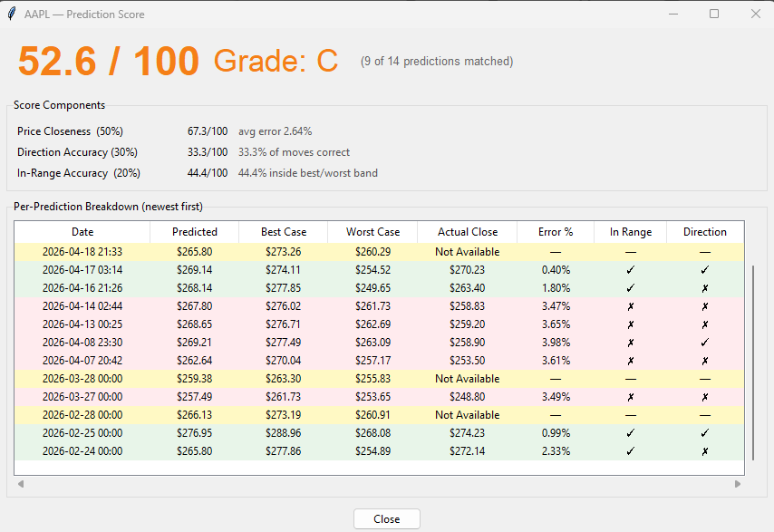
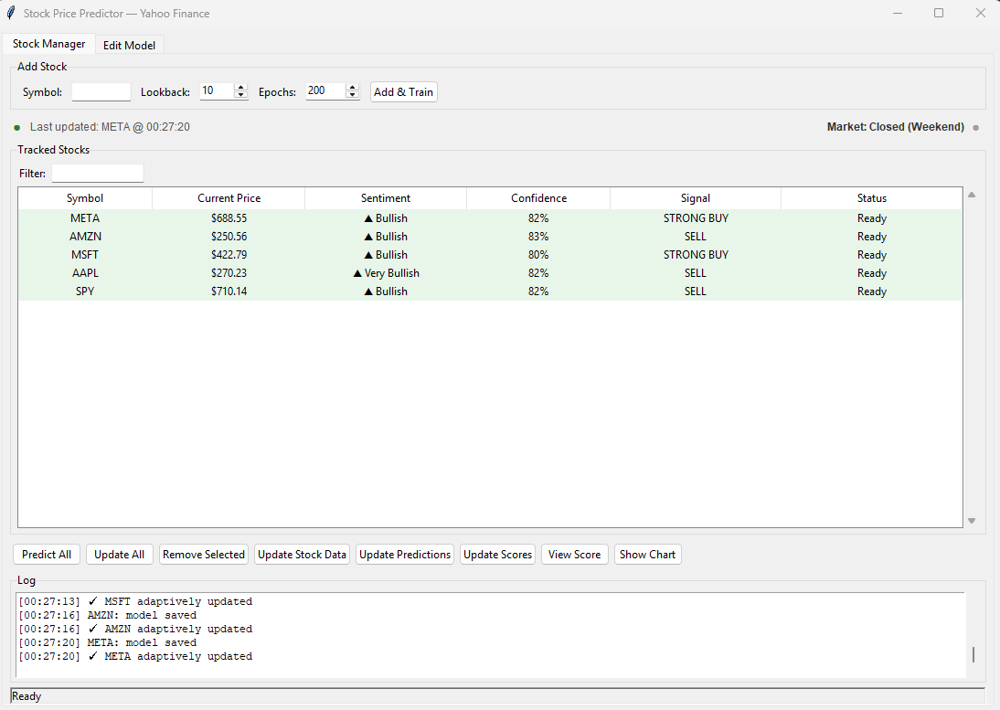
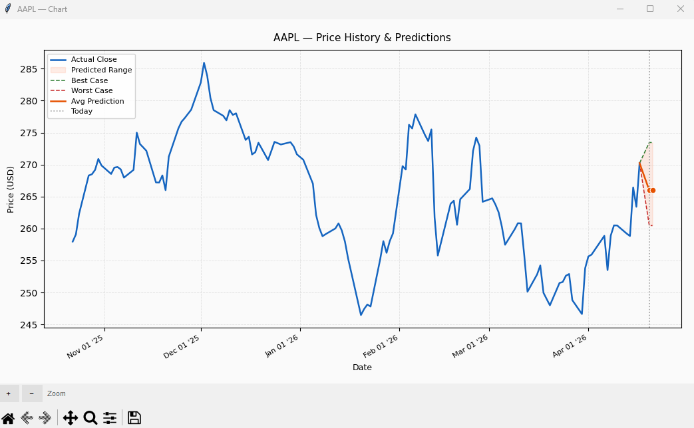
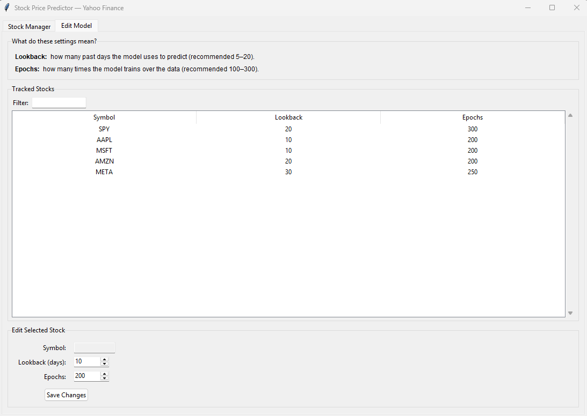

# Stock Price Prediction Neural Network

A modular neural network system that fetches stock data from **Yahoo Finance** (no API key required) and predicts OHLCV (Open, High, Low, Close, Volume) prices with scenario analysis, accuracy scoring, and full model persistence. Comes with a complete Tkinter GUI for managing multiple stocks simultaneously.

## Features

- **Multi-Output Neural Network**: Predicts all price points (Open, High, Low, Close, Volume) simultaneously
- **Advanced Scenario Analysis**: Generates Best Case, Average Case, and Worst Case forecasts
- **Yahoo Finance Integration**: Free, no API key needed — data fetched via `yfinance`
- **Adaptive Learning**: Continues learning from new data on each update cycle
- **Technical Indicators**: RSI, MACD, SMA (20/50), Bollinger Bands, Volume Ratio, Volatility, Momentum
- **Market Sentiment Analysis**: Bullish/bearish scoring across multiple indicator signals
- **Model Persistence (JSON + CSV)**: Network weights, scaler params, and prediction history saved to `stock_models.json` / `stock_models_history.csv` after every train, predict, and update — model resumes from where it left off on next startup
- **Accuracy Scoring**: Composite 0–100 score with letter grades (A+ → F) measuring price error, directional accuracy, and within-range hits
- **Band Calibration**: Best/worst case bands are automatically widened using historical residuals from `prediction_score.xlsx` when ≥5 matched predictions are available, targeting a 75% in-range rate
- **Complete GUI**: Multi-tab interface — Stock Manager, Edit Model, and on-demand chart popups
- **Market Status Indicator**: Live color-coded label showing Pre-Market, Open, After-Hours, or Closed (US Eastern time)
- **Interactive Charts**: Per-stock popup window with actual price history and forecast band (best/worst/avg); zoom / pan / save toolbar; auto-refreshes when a new prediction arrives
- **Stock Filter**: Search bar in both the Stock Manager and Edit Model tabs to quickly filter tracked symbols by name
- **Edit Model Tab**: Adjust lookback and epoch settings per stock without restarting; changes apply on the next training run
- **Background Auto-Updates**: Adaptive model updates round-robin across all tracked symbols; predictions refreshed every 5 minutes — the UI never freezes
- **Live Current Price**: Current Price column reflects the latest traded price (intraday during market hours, official close after market close) — not a stale end-of-previous-day value
- **Excel Export**: OHLCV history → `stock_data.xlsx`; prediction scenarios → `stock_predictions.xlsx`; full prediction score breakdown → `prediction_score.xlsx`

## Quick Start

```bash
# Install dependencies
pip install -r requirements.txt

# Launch
python launch.py
```

No API key setup required. Add a symbol and training begins immediately.

## Installation

1. **Clone or download the repository**
2. **Install dependencies**
```bash
pip install -r requirements.txt
```

Required packages: `numpy`, `pandas`, `matplotlib`, `yfinance`, `openpyxl`, `requests`

## System Architecture

The project follows SOLID principles with a clean dependency-inversion layer. All high-level modules depend on abstract interfaces (`core/interfaces.py`), and concrete implementations are wired together in `ui/app.py`.

### Package Layout

```
core/
  interfaces.py     — Abstract base classes (IDataFetcher, IModelRepository, IHistoryRepository, ISymbolRepository)
  models.py         — Shared data models (ScoreResult, PredictionRecord)

data/
  fetcher.py        — YahooFinanceFetcher (implements IDataFetcher)
  indicators.py     — Technical indicator calculations

ml/
  network.py        — NeuralNetwork (forward/backward, Monte Carlo uncertainty)
  trainer.py        — ModelTrainer (epoch loop, warm-up + step-decay LR schedule)
  predictor.py      — StockPredictor (scenario generation)

scoring/
  scorer.py         — score_symbol() — composite 0–100 accuracy score function
  calibration.py    — load_calibration() / apply_calibration() — band widening from historical residuals

services/
  trading_service.py — StockTradingService (data + ML orchestration)
  stock_registry.py  — StockRegistry (in-memory store + background thread workers)

storage/
  model_repository.py   — JsonModelRepository (network weights → stock_models.json)
  history_repository.py — CsvHistoryRepository (prediction log → stock_models_history.csv)
  symbol_repository.py  — JsonSymbolRepository (tracked symbols → tracked_symbols.json)
  excel_exporter.py     — ExcelExporter (OHLCV + prediction xlsx files)

ui/
  app.py           — StockPriceApp (root window, tab composition, message-queue bridge)
  stock_tab.py     — StockManagerTab (symbol table, filter, buttons, activity log)
  chart_tab.py     — StockChartWindow (on-demand popup chart per symbol)
  edit_model_tab.py — EditModelTab (per-stock lookback/epoch editor with filter)

launch.py       — Dependency checker and entry point
```

### Neural Network (`ml/network.py`)

`NeuralNetwork` — custom two-layer network (ReLU hidden, linear output):

```
Input Layer  (lookback_window × 12 features)
      ↓
Hidden Layer (30 neurons, ReLU + Monte Carlo noise at inference)
      ↓
Output Layer (5 outputs: Open, High, Low, Close, Volume)
```

Training uses He initialisation, MSE loss, and an adaptive learning rate that halves when gradient variance is high.

**12 features per time step:**
1. Open
2. High
3. Low
4. Close
5. Volume
6. SMA-20
7. RSI (14-period)
8. Volume Ratio (vs 20-day average)
9. Volatility (20-day std)
10. MACD
11. MACD Signal
12. Price Momentum (10-day)

### Accuracy Scoring (`scoring/scorer.py`)

Composite score (0–100) from three components:

| Component | Weight | What it measures |
|-----------|--------|-----------------|
| MAPE accuracy | 50% | How close the predicted close was |
| Directional accuracy | 30% | Did the model get up/down right? |
| Within-range accuracy | 20% | Did the actual close land inside the best/worst band? |

Letter grades: A+ (≥93) → F (<20). Scores update automatically after every prediction cycle.


*Prediction score breakdown with letter grades and per-prediction accuracy metrics*

### Service & Registry (`services/`)

- `StockTradingService` — orchestrates data fetching, feature engineering, training, prediction, and adaptive updates
- `StockRegistry` — manages all tracked stocks, runs training / prediction / update jobs in background threads, delegates to injected repositories

### Model Persistence Flow

```
_train_thread
    → JsonModelRepository.restore_weights  (if saved weights exist → resume & short retrain)
    → ModelTrainer.train                   (full epochs if new; ~20% epochs if resuming)
    → JsonModelRepository.save            (weights + scaler → stock_models.json)
    → CsvHistoryRepository.save           (pred_history → stock_models_history.csv)

_predict_thread / _update_thread
    → predict / adaptive_update
    → archive_prediction    (push current pred into history)
    → save model + history
```

### Excel File Layout

| File | Contents |
|------|---------|
| `stock_data.xlsx` | One sheet per symbol — append-only OHLCV history |
| `stock_predictions.xlsx` | One sheet per symbol — scenario rows (Best Case / Average Case / Worst Case) |
| `prediction_score.xlsx` | One sheet per symbol — every archived prediction with Predicted Close, Best Case, Worst Case, Actual Close, Error %, In Range, and Direction Correct; unmatched rows show "Pending" or "Not Available" |

### Persistence File Layout

| File | Contents |
|------|---------|
| `stock_models.json` | Network weights and scaler params per symbol |
| `stock_models_history.csv` | Prediction log (Symbol, Date, Avg, Best, Worst) — up to 5 most recent entries per symbol |
| `tracked_symbols.json` | Tracked symbols with lookback and epoch settings |

### Market Status Indicator

The status bar shows the current US market session based on Eastern time:

| Status | Hours (ET) | Colour |
|--------|-----------|--------|
| Pre-Market | 4:00 AM – 9:30 AM | Orange |
| Market Open | 9:30 AM – 4:00 PM | Green |
| After-Hours | 4:00 PM – 8:00 PM | Blue |
| Closed / Weekend | All other times | Grey |

Updates every 60 seconds automatically.

## Usage

### GUI Workflow


*Stock Manager tab showing tracked symbols, predictions, scores, and activity log*

```
1. python launch.py
2. Enter a stock symbol (e.g. AAPL) and click "Add & Train"
3. Watch training progress in the Log
4. Select a stock and click "Show Chart" to open its price history and forecast popup
5. Click "Predict All" to refresh forecasts
6. Click "Update All" for adaptive incremental learning
7. Click "Update Stock Data" or "Update Predictions" to write xlsx files
8. Switch to "Edit Model" to adjust lookback/epoch settings per stock
```

### GUI Button Reference

| Button | Action |
|--------|--------|
| Add & Train | Add a symbol and train the network (resumes from saved weights if available) |
| Predict All | Refresh predictions for every tracked stock |
| Update All | Adaptive update for every tracked stock |
| Remove Selected | Remove selected stock(s) from the tracker |
| Update Stock Data | Append new OHLCV rows to `stock_data.xlsx` (recreates file if corrupt) |
| Update Predictions | Append new prediction rows to `stock_predictions.xlsx` |
| Update Scores | Write the full prediction score breakdown to `prediction_score.xlsx` — all archived predictions, with Actual Close filled in where available and "Pending" / "Not Available" for future or weekend dates |
| View Score | Show accuracy score and all archived predictions for the selected stock in a popup window — matches `prediction_score.xlsx` one-to-one |
| Show Chart | Open a chart popup for the selected stock showing price history and forecast; brings existing window to front if already open |


*Per-stock chart popup with actual price history and best/average/worst case forecast bands*


*Edit Model tab for adjusting lookback and epoch settings per stock*

### Scenario Generation

Three scenarios are derived from the base prediction by applying volatility multipliers shaped by:
- Current RSI and MACD readings
- Market sentiment score
- Recent price volatility
- Model confidence

## Key Parameters

| Parameter | Default | Description |
|-----------|---------|-------------|
| `lookback_window` | 10 | Historical days used as input to the network |
| `hidden_size` | 30 | Neurons in the hidden layer |
| `learning_rate` | 0.001 | Initial LR; halved when gradient variance is high |
| `epochs` | 200 | Training iterations (full train); ~20% for resume |
| `input_features` | 12 | Features per time step |
| `outputs` | 5 | Predicted values (OHLCV) |

## Files in the Project

| File / Directory | Purpose |
|-----------------|---------|
| `launch.py` | Dependency checker and entry point |
| `core/interfaces.py` | Abstract base classes: `IDataFetcher`, `IModelRepository`, `IHistoryRepository`, `ISymbolRepository` |
| `core/models.py` | Shared data models (ScoreResult, PredictionRecord) |
| `data/fetcher.py` | Yahoo Finance data fetcher |
| `data/indicators.py` | Technical indicator calculations |
| `ml/network.py` | Two-layer neural network |
| `ml/trainer.py` | Training loop with warm-up + step-decay LR |
| `ml/predictor.py` | Prediction and scenario generation |
| `scoring/scorer.py` | `score_symbol()` — composite accuracy scoring |
| `scoring/calibration.py` | `load_calibration()` / `apply_calibration()` — band calibration from historical residuals |
| `services/trading_service.py` | Data + ML orchestration |
| `services/stock_registry.py` | In-memory stock registry + background workers |
| `storage/model_repository.py` | JSON model weight persistence |
| `storage/history_repository.py` | CSV prediction history persistence |
| `storage/symbol_repository.py` | JSON tracked-symbol persistence |
| `storage/excel_exporter.py` | OHLCV + prediction Excel export |
| `ui/app.py` | Root window, tab wiring, message-queue bridge |
| `ui/stock_tab.py` | Stock Manager tab (symbol table, filter, buttons, log) |
| `ui/chart_tab.py` | Per-stock chart popup window |
| `ui/edit_model_tab.py` | Edit Model tab (lookback/epoch editor with filter) |
| `requirements.txt` | Python package dependencies |
| `tracked_symbols.json` | Auto-generated: saved symbols and their settings |
| `stock_models.json` | Auto-generated: saved network weights + scaler params |
| `stock_models_history.csv` | Auto-generated: prediction history log (5 most recent per symbol) |
| `stock_data.xlsx` | Auto-generated: OHLCV history |
| `stock_predictions.xlsx` | Auto-generated: prediction scenarios (Best / Average / Worst Case) |
| `prediction_score.xlsx` | Auto-generated: full prediction score breakdown — all rows, matched and unmatched |

## Technical Indicators

1. **Moving Averages** — SMA-20, SMA-50
2. **RSI** — 14-period Relative Strength Index
3. **Bollinger Bands** — 20-day, ±2 std
4. **MACD** — (12, 26, 9)
5. **Volume Indicators** — SMA, ratio vs average
6. **Volatility** — 20-day standard deviation
7. **Price Momentum** — 10-day
8. **Support & Resistance** levels
9. **Trend Analysis** — short and long term

## Troubleshooting

**Missing packages:**
```bash
pip install numpy pandas matplotlib yfinance openpyxl requests
```

**"No data available" for a symbol:**
- Verify the ticker is valid on Yahoo Finance (e.g. `AAPL`, `MSFT`, `SPY`)
- Check your internet connection
- `yfinance` may be temporarily rate-limited; wait a moment and retry

**GUI not launching:**
```bash
python --version   # requires Python 3.9+
python launch.py   # checks dependencies before opening the GUI
```

**Weights not loading on startup:**
- `stock_models.json` is created after the first successful training run
- If the saved `input_size` doesn't match the current feature count (e.g. after a feature set change), the model logs a warning and retrains from scratch

**"Update Stock Data" fails:**
- If `stock_data.xlsx` is corrupt or empty, it will be automatically recreated from the current in-memory data

## Disclaimer

**IMPORTANT**: This is an educational project for demonstration purposes only.

- **Not Financial Advice**: Predictions are based on historical patterns and must not be used for actual trading decisions
- **Market Risk**: Stock markets are volatile and past performance is not indicative of future results
- **Model Limitations**: Neural networks have inherent uncertainty — treat outputs as one signal among many

Always consult a qualified financial professional before making investment decisions.
